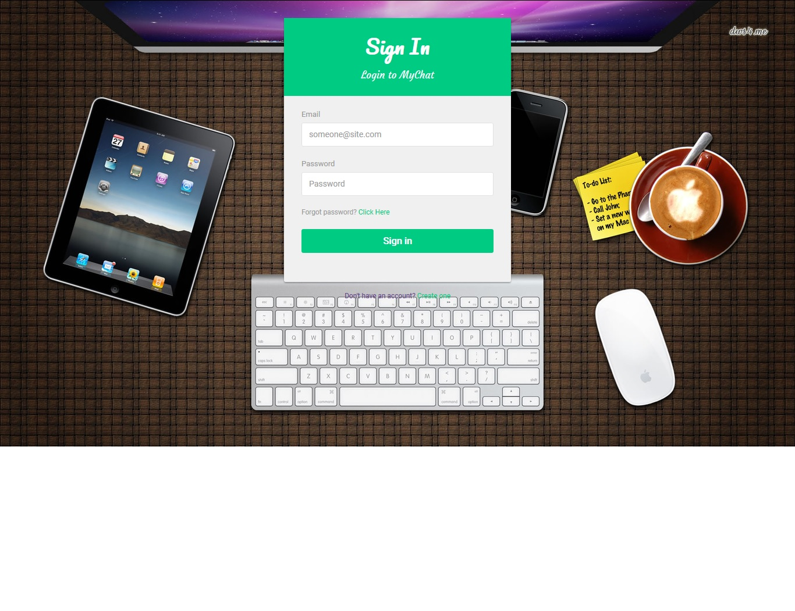
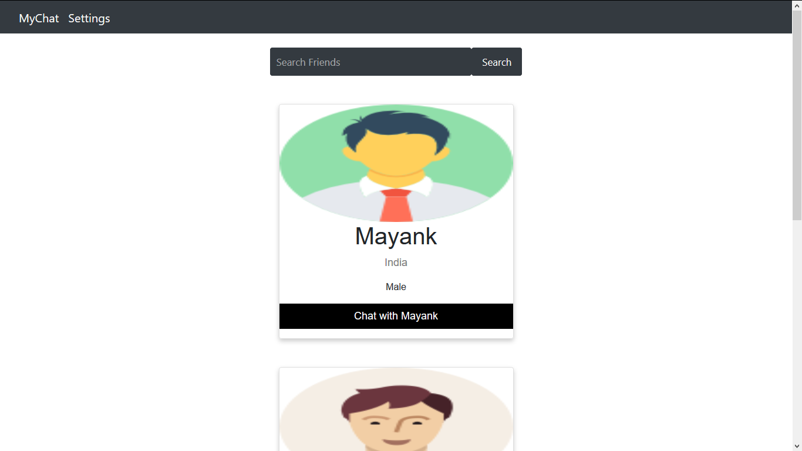
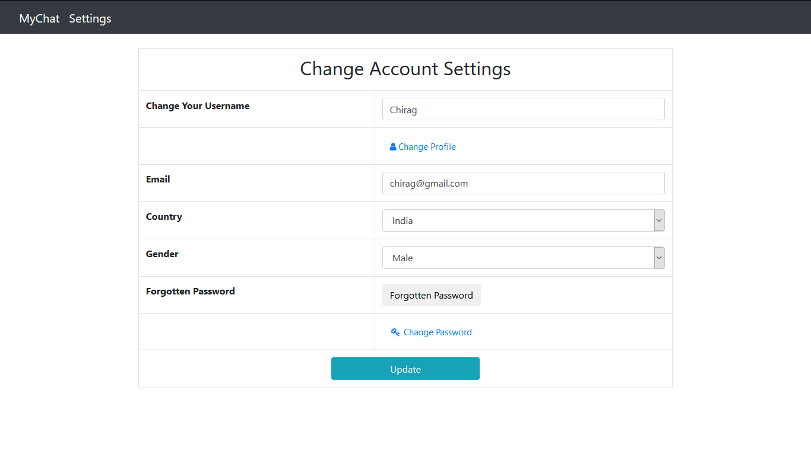
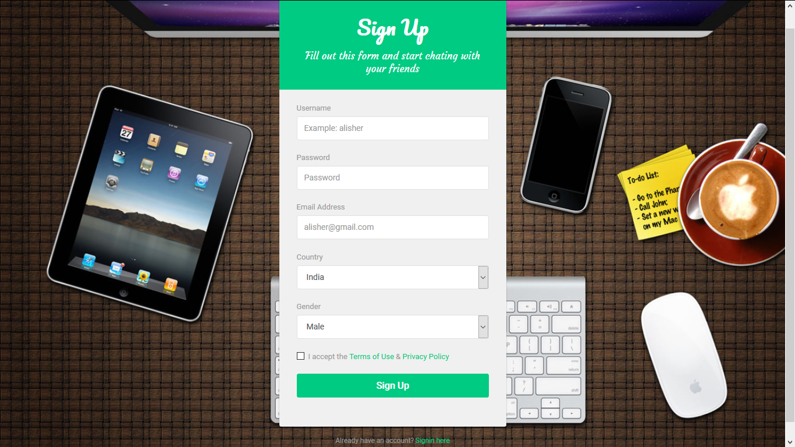
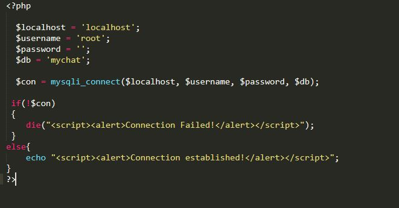
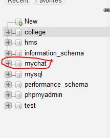
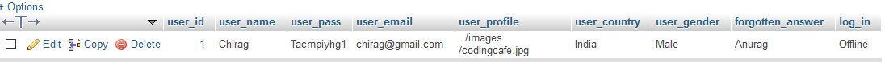

# Online Chat Application

## Introduction 
>The project is a chat application created using **HTML**,**CSS**, **JavaScript** & **Bootstrap** as frontend languages and **PHP** as the backend language. This application allows users to chat with other people over the internet. This chat application helps in smooth functioning of daily tasks of an organization employees and information delivery at any points. This chat application can also be used in local servers so that information exchange can take place within the organization.

## Screenshots 

> Login Page  
 
> Dashboard  
 
> Find Friends  
 
> Settings  
 
> Register Page  
 

## How to use
> **Connection Script**  
 
Change the **Local Host** ,**Username**, **Password**, **Database**, According to your setup
> **Database Setup**  
Create the database name like the screenshot given below  
 
Create the table with the table name <b>users</b> and with the attributes exactly same like the screenshot given below  
 
> Create the table with the table name <b>users_chats</b> and with the attributes exactly same like the screenshot given below  
  
> ENJOY!
